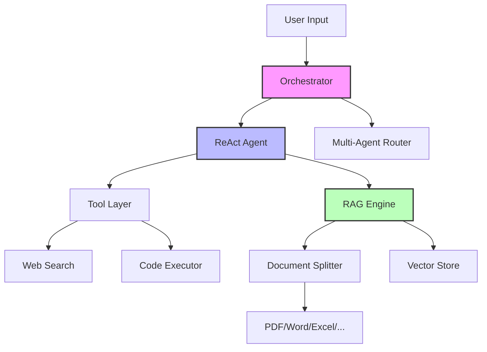
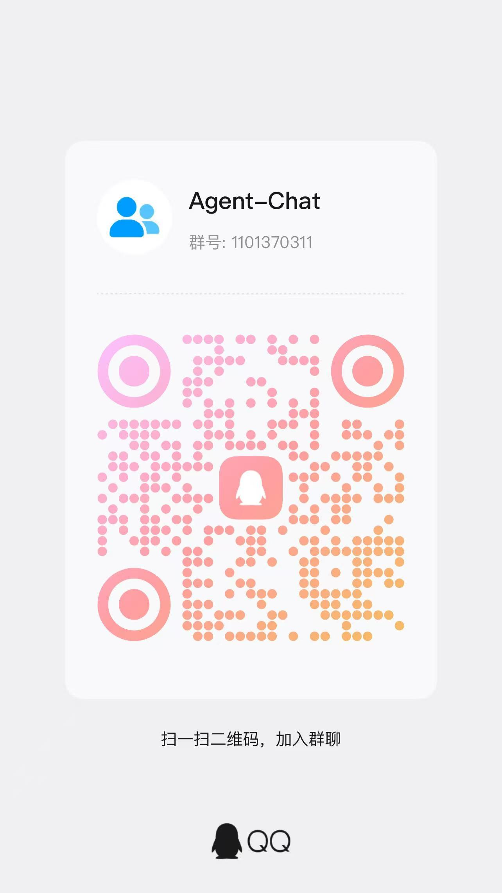

<div align="center">

# 🤖 Agent Chat

[](https://www.python.org/)
[](LICENSE)
[]()
[](mailto:tzyang_iebd22@stu.sdua.edu.cn)

**从零构建模块化多Agent对话系统 | Modular Multi-Agent Framework Built from Scratch**

[项目愿景](#-项目愿景) • [架构设计](#-架构设计) • [开发路线](#-开发路线) • [如何参与](#-如何参与) • [快速开始](#-快速开始)

中文版 | [English](README_EN.md)

</div>

---

## 🎯 项目愿景

Agent-Chat 是一个**技术友好型**的LLM Agent框架，旨在通过从零实现核心模块，深入理解现代Agent系统的架构原理。与依赖重型封装的框架不同，我们追求：

- **透明性**：每个组件（RAG、Tools、ReAct、Multi-Agent）都是独立可二次开发的模块
- **可扩展性**：插件化架构，支持快速接入新的LLM、向量数据库、工具集
- **生产就绪**：代码遵循工业级标准，类型提示、单元测试、文档齐全

> **🚀 我们正在寻找对LLM系统架构感兴趣的开发者！** 无论你是想深入RAG优化、Agent协作算法，还是LLM工具链开发，这里都有适合你的切入点。

---

## 🏗️ 架构设计



### 核心模块

| 模块 | 状态 | 技术栈 | 描述 |
|------|------|--------|------|
| **Document Splitter** | 🟡 开发中 | [PaddleOCR](https://github.com/PaddlePaddle/PaddleOCR), PyMuPDF, python-docx | 多格式文档解析与智能分块 |
| **RAG Engine** | 🔴 规划中 | FAISS/Chroma, Sentence-Transformers | 检索增强生成核心 |
| **Tool System** | 🔴 规划中 | FastAPI, aiohttp | 外部工具集成与编排 |
| **ReAct Agent** | 🔴 规划中 | LangChain-style, 自研实现 | 推理-行动循环实现 |
| **Multi-Agent** | 🔴 规划中 | AutoGen-inspired | 多Agent协作与通信协议 |

---

## 🗺️ 开发路线

### ✅ 已完成 (V0.1)
- [x] 基础项目架构与CI/CD配置
- [x] **文档解析引擎 V1** - 基于PaddleOCR的多格式支持
  - [x] PDFSplitter
  - [x] DocxSplitter
  - [x] ExcelSplitter
  - [x] CsvSplitter
  - [x] HtmlSplitter
  - [x] JsonSplitter
  - [x] MdSplitter
  - [x] TxtSplitter

### 🚧 进行中 (V0.2 - Q2 2026)
- [ ] **文档分块**
  - [ ] 结构感知
  - [ ] 层次化混合切分
- [ ] **基础RAG Pipeline**
  - [ ] 向量化与索引
  - [ ] 检索策略实现
- [ ] **Tool系统集成**
  - [ ] WebSearch工具
  - [ ] Python代码执行沙箱

### 📋 计划中 (V0.3+)
- [ ] **ReAct Agent核心**
  - [ ] 推理轨迹追踪
  - [ ] 工具选择与调用
  - [ ] 自我纠错机制
- [ ] **多Agent架构**
  - [ ] Agent注册与发现
  - [ ] 消息总线 (Message Bus)
  - [ ] 协作模式 (协作/竞争/监督)
- [ ] **Web UI**

---

## 🛠️ 技术栈

```yaml
Core: Python 3.8+, Pydantic, asyncio
LLM: OpenAI API, Anthropic Claude, Local LLM (vLLM/Ollama)
RAG: 
  - OCR: PaddleOCR (PP-OCRv4/PPStructureV3)
  - VectorDB: FAISS / Chroma / Milvus
  - Embeddings: BGE-M3, GTE-large
Tools:
  - Web: aiohttp, beautifulsoup4
  - Data: pandas, openpyxl, python-docx, PyMuPDF, orjson， 
Dev: pytest, black, ruff, mypy, pre-commit
```

---

## 🚀 快速开始

```bash
# 1. 克隆仓库
git clone https://github.com/yangtengze/Agent-Chat.git
cd Agent-Chat

# 2. 安装依赖 (推荐conda/venv)

## paddle ocr
    # CPU 版本
    python -m pip install paddlepaddle==3.2.0 -i https://www.paddlepaddle.org.cn/packages/stable/cpu/

    # GPU 版本，需显卡驱动程序版本 ≥450.80.02（Linux）或 ≥452.39（Windows）
    python -m pip install paddlepaddle-gpu==3.2.0 -i https://www.paddlepaddle.org.cn/packages/stable/cu118/

    # GPU 版本，需显卡驱动程序版本 ≥550.54.14（Linux）或 ≥550.54.14（Windows）
    python -m pip install paddlepaddle-gpu==3.2.0 -i https://www.paddlepaddle.org.cn/packages/stable/cu126/
## orther
    pip install -r requirements.txt
```

### 使用示例

```python
from PDFSplitter import PDFSplitter

# 初始化带OCR的PDF解析器
splitter = PDFSplitter("document.pdf")

# 解析
splitter.parse_pdf()
```

---

## 🤝 如何参与

我们特别欢迎以下方向的贡献者：

| 方向 | 需要的技能 | 具体任务 | 难度 |
|------|-----------|---------|------|
| **RAG优化** | NLP, 信息检索 | 实现结构感知和层次化混合切分, 优化检索召回率 |⭐⭐⭐ |
| **Agent算法** | LLM, 算法设计 | 实现ReAct, Plan-and-Solve等Agent架构 | ⭐⭐⭐⭐ |
| **工程架构** | Python, 系统设计 | 设计插件系统, 优化并发性能 | ⭐⭐⭐ |
| **工具集成** | API设计, 爬虫 | 开发WebSearch, 数据库查询等工具 | ⭐⭐ |
| **前端开发** | SpringBoot, Vue | 开发Agent调试与对话界面 | ⭐⭐⭐ |

### 开始贡献

1. **查看 [Good First Issues](../../issues?q=is:issue+is:open+label:"good+first+issue")** - 适合新手上手
2. **阅读 [Contributing Guide](CONTRIBUTING.md)** - 代码规范与提交流程
3. **加入讨论** - 对架构设计有疑问？开Issue讨论或发邮件
4. **提交PR** - Fork → 开发 → 测试 → PR

### 联系方式

📧 **Email**: [tzyang_iebd22@stu.sdua.edu.cn](mailto:tzyang_iebd22@stu.sdua.edu.cn)  
💬 **Issues**: [GitHub Issues](../../issues) (推荐公开技术讨论)  
📝 **Project Board**: [看板进度](../../projects)

> **学生/研究友好**: 如果你是SDUA学生或对Agent系统研究感兴趣，欢迎将此作为课程项目或科研实践！我们提供详细的代码Review和架构指导。

---

## 📄 qq群
- 1101370311


---

<div align="center">

**⭐ Star 这个项目如果它对你有帮助 | Fork 并开始你的Agent构建之旅**

</div>