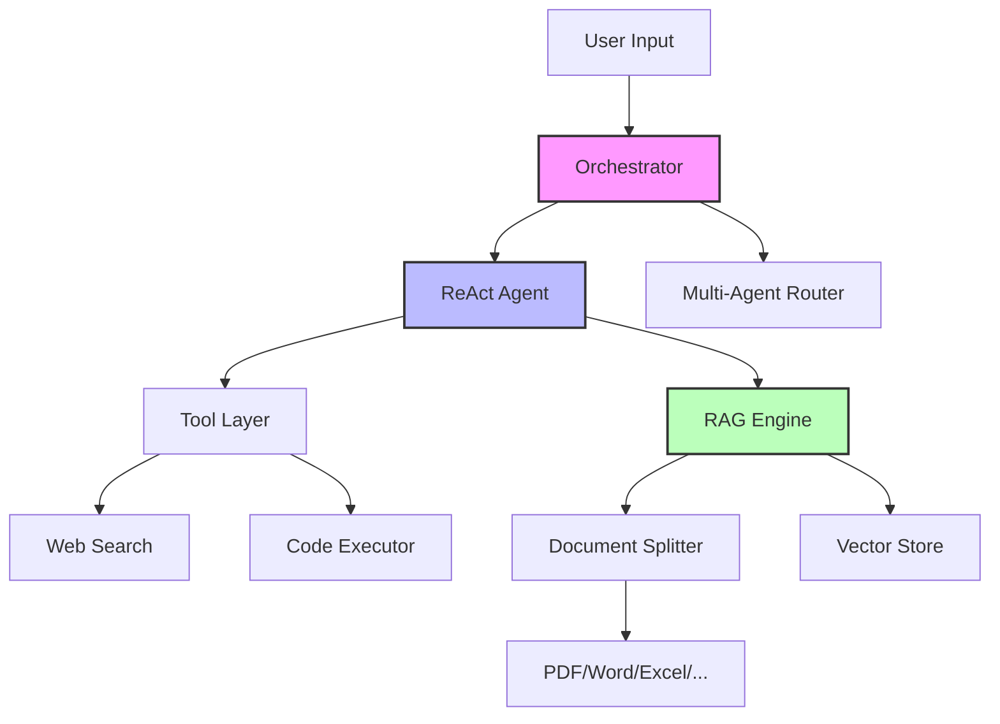

<div align="center">

# 🤖 Agent Chat

[](https://www.python.org/)
[](LICENSE)
[]()
[](mailto:tzyang_iebd22@stu.sdua.edu.cn)

**Modular Multi-Agent Framework Built from Scratch**

[Project Vision](#-project-vision) • [Architecture](#-architecture) • [Roadmap](#-roadmap) • [How to Contribute](#-how-to-contribute) • [Quick Start](#-quick-start)
[中文版](README.md) | English

</div>

---

## 🎯 Project Vision

Agent-Chat is a **technology-friendly** LLM Agent framework designed to comprehensively understand the architecture principles of modern Agent systems by building core modules from scratch. Unlike frameworks that rely on heavy encapsulation, we aim for:

- **Transparency**: Every component (RAG, Tools, ReAct, Multi-Agent) is an independent module that can be developed and customized.
- **Extensibility**: A plug-in architecture that supports quickly integrating new LLMs, vector databases, and toolsets.
- **Production-Ready**: The code follows industrial standards with type hints, unit tests, and comprehensive documentation.

> **🚀 We are looking for developers interested in LLM system architecture!** Whether you want to dive into RAG optimization, Agent collaboration algorithms, or LLM toolchain development, there is a good starting point for you here.

---

## 🏗️ Architecture Design



### Core Modules

| Module | Status | Tech Stack | Description |
|------|------|--------|------|
| **Document Splitter** | 🟡 In Development | [PaddleOCR](https://github.com/PaddlePaddle/PaddleOCR), PyMuPDF, python-docx | Multi-format document parsing and intelligent chunking |
| **RAG Engine** | 🔴 Planned | FAISS/Chroma, Sentence-Transformers | Core logic for Retrieval-Augmented Generation |
| **Tool System** | 🔴 Planned | FastAPI, aiohttp | External tool integration and orchestration |
| **ReAct Agent** | 🔴 Planned | LangChain-style, in-house implementation | Reason and Act (ReAct) loop implementation |
| **Multi-Agent** | 🔴 Planned | AutoGen-inspired | Multi-Agent collaboration and communication protocols |

---

## 🗺️ Roadmap

### ✅ Completed (V0.1)
- [x] Basic project architecture and CI/CD setup
- [x] **Document Parsing Engine V1** - Multi-format support based on PaddleOCR
  - [x] PDFSplitter
  - [x] DocxSplitter
  - [x] ExcelSplitter
  - [x] CsvSplitter
  - [x] HtmlSplitter
  - [x] JsonSplitter
  - [x] MdSplitter
  - [x] TxtSplitter

### 🚧 In Progress (V0.2 - Q2 2026)
- [ ] **Document Chunking**
  - [ ] Structure-aware slicing
  - [ ] Hierarchical hybrid chunking
- [ ] **Basic RAG Pipeline**
  - [ ] Vectorization and indexing
  - [ ] Retrieval strategy implementation
- [ ] **Tool System Integration**
  - [ ] WebSearch tool
  - [ ] Python code execution sandbox

### 📋 Planned (V0.3+)
- [ ] **ReAct Agent Core**
  - [ ] Reasoning trajectory tracking
  - [ ] Tool selection and invocation
  - [ ] Self-correction mechanism
- [ ] **Multi-Agent Architecture**
  - [ ] Agent registration and discovery
  - [ ] Message Bus
  - [ ] Collaboration patterns (Collaboration / Competition / Supervision)
- [ ] **Web UI**

---

## 🛠️ Tech Stack

```yaml
Core: Python 3.8+, Pydantic, asyncio
LLM: OpenAI API, Anthropic Claude, Local LLM (vLLM/Ollama)
RAG: 
  - OCR: PaddleOCR (PP-OCRv4/PPStructureV3)
  - VectorDB: FAISS / Chroma / Milvus
  - Embeddings: BGE-M3, GTE-large
Tools:
  - Web: aiohttp, beautifulsoup4
  - Data: pandas, openpyxl, python-docx, PyMuPDF, orjson 
Dev: pytest, black, ruff, mypy, pre-commit
```

---

## 🚀 Quick Start

```bash
# 1. Clone the repository
git clone https://github.com/yangtengze/Agent-Chat.git
cd Agent-Chat

# 2. Install dependencies (conda/venv recommended)

## Paddle OCR
    # CPU version
    python -m pip install paddlepaddle==3.2.0 -i https://www.paddlepaddle.org.cn/packages/stable/cpu/

    # GPU version, requires graphics driver version ≥450.80.02 (Linux) or ≥452.39 (Windows) for CUDA 11.8
    python -m pip install paddlepaddle-gpu==3.2.0 -i https://www.paddlepaddle.org.cn/packages/stable/cu118/

    # GPU version, requires graphics driver version ≥550.54.14 (Linux) or ≥550.54.14 (Windows) for CUDA 12.6
    python -m pip install paddlepaddle-gpu==3.2.0 -i https://www.paddlepaddle.org.cn/packages/stable/cu126/

## Other dependencies
    pip install -r requirements.txt
```

### Example Usage

```python
from PDFSplitter import PDFSplitter

# Initialize the PDF parser with OCR capabilities
splitter = PDFSplitter("document.pdf")

# Parse
splitter.parse_pdf()
```

---

## 🤝 How to Contribute

We especially welcome contributors in the following areas:

| Area | Required Skills | Specific Tasks | Difficulty |
|------|-----------|---------|------|
| **RAG Optimization** | NLP, Information Retrieval | Implement structure-aware and hierarchical chunking, optimize retrieval recall | ⭐⭐⭐ |
| **Agent Algorithms** | LLM, Algorithm Design | Implement ReAct, Plan-and-Solve and other Agent architectures | ⭐⭐⭐⭐ |
| **Engineering Arch** | Python, System Design | Design plugin system, optimize concurrency performance | ⭐⭐⭐ |
| **Tool Integration** | API Design, Web Scraping | Develop WebSearch, database query and other tools | ⭐⭐ |
| **Frontend Dev** | SpringBoot, Vue | Develop Agent debugging and chat interface | ⭐⭐⭐ |

### Getting Started

1. **Check out [Good First Issues](../../issues?q=is:issue+is:open+label:"good+first+issue")** - Great for beginners.
2. **Read the [Contributing Guide](CONTRIBUTING.md)** - Code standards and pull request workflows.
3. **Join Discussions** - Have questions about architecture? Open an issue or send an email.
4. **Submit a PR** - Fork → Develop → Test → Pull Request.

### Contact Information

📧 **Email**: [tzyang_iebd22@stu.sdua.edu.cn](mailto:tzyang_iebd22@stu.sdua.edu.cn)  
💬 **Issues**: [GitHub Issues](../../issues) (Public technical discussions recommended)  
📝 **Project Board**: [Project Progress](../../projects)

> **Student/Researcher Friendly**: If you are a student at SDUA or interested in Agent system research, feel free to use this as a course project or research practice! We provide detailed code reviews and architecture guidance.

---

## 📄 Microsoft Teams
Hello! Join chat in [Microsoft Teams](https://teams.live.com/l/invite/FEAilswV7xlxfHVZwI?v=g1)

---

<div align="center">

**⭐ Star this project if it helps you | Fork it and start your Agent building journey**

</div>
